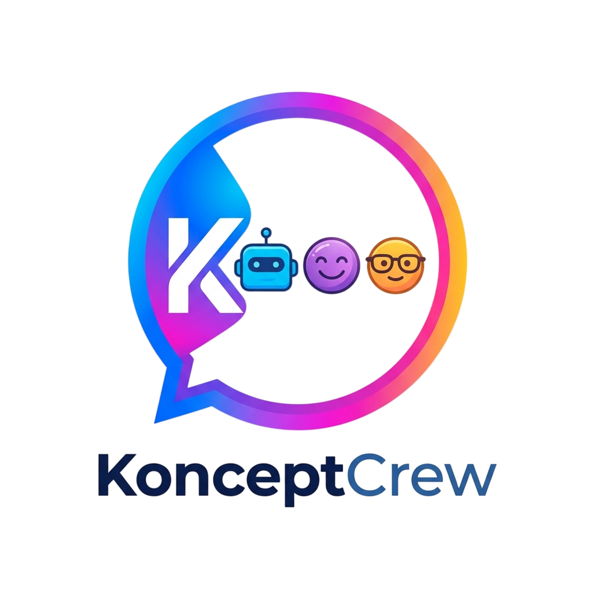

<div align="center">
  
  <h1>🔮 KonceptCrew</h1>
  <p><strong>Votre Équipe d'Élite IA / Your Elite AI Crew</strong></p>
</div>


> **« Your AI Crew. Your Way. »**  
> Une plateforme d'orchestration de spécialistes IA ultra-personnalisés, dotée d'une interface utilisateur d'élite inspirée des meilleurs standards de design modernes. Conçue pour offrir des sessions de travail fluides, immersives et locales-premières.
>
> *An orchestration platform for ultra-personalized AI specialists, featuring an elite UI inspired by the highest modern design standards. Designed for smooth, immersive, and local-first work sessions.*

Créé avec passion par / Developed with passion by **Alex Koncept** ([Portfolio](https://alexkoncept.github.io/) | [contact@alexkoncept.com](mailto:contact@alexkoncept.com))

---

## 🌎 Language Quick Links
* 🇫🇷 [Version Française](#-version-française)
* 🇬🇧 [English Version](#-english-version)

---

## 🇫🇷 Version Française

### ✨ Fonctionnalités Majeures

#### 💻 1. Gestion d'Équipage Réactive & Favoris
* **Système de Favoris Dynamique** : Marquez vos spécialistes d'une étoile pour les épingler au sommet de votre sidebar dans la section exclusive `Favoris`.
* **Rendu d'État Avancé** : Indicateurs visuels dynamiques d'activité (*waves* audio décoratives interactives et indicateurs « En ligne »).
* **Création Holistique** : Créez ou modifiez un spécialiste avec le formulaire du `Studio de Création`, générez un avatar par IA ou importez le vôtre.

#### 🎙️ 2. Écran Immersif de Session Vocale (Live Voice Mode)
* Un bandeau d'appel vocal interactif répliquant fidèlement la maquette de référence :
  * Double analyseur de spectre en temps réel (un spectre bleu électrique pour la voix de l'utilisateur, un spectre rose magenta pour l'écoute du spécialiste IA).
  * Avatar central magnifié par des anneaux lumineux et des ombres portées dynamiques multi-couleurs en gradient (`#5969F3`, `pink`, `cyan`).
  * Contrôle complet du microphone avec retours d'état visuels.

#### 🖼️ 3. Ingénierie de Prompt & Génération d'Images Intégrée
* **Illustrations à la demande** : L'IA utilise la puissance multimodale pour traduire l'explication courante en image illustrative, au clic d'un bouton ou de façon proactive.
* **Génération d'Avatars** : Créez des visuels de profils via une IA visuelle depuis le Studio.
* **Agnostique au fournisseur** : Tous les appels de génération visuelle transitent par un proxy serveur interne robuste, prenant en charge Gemini (Imagen 3), OpenAI (DALL-E 3) et les LLM de pointe exécutés en local (LM Studio, Ollama).

#### 📑 4. RAG expert & Export de Rapports Scientifiques
* **Docs & RAG** : Association et injection à la volée de packs de connaissances exclusifs textuels directement dans le contexte du modèle (RAG local-first).
* **Export Markdown d'Élite** : Génération instantanée d'un compte rendu de session complet et structuré au format Markdown (`.md`) d'un seul clic.

#### 🛡️ 5. Contrôle d'Usine & Sécurité
* **Purger d'Urgence** : Un panneau de confirmation modal hautement visuel avec avertissements de sécurité esthétiques pour réinitialiser le cache local ou vider l'historique sans risque d'erreur d’inattention.

### 🚀 Installation & Développement

#### Prérequis
* **Node.js** v18+  
* **npm** ou **yarn**  

#### Procédure de Lancement rapide

1. **Installer les dépendances** :
   ```bash
   npm install
   ```

2. **Configurer les Variables d'Environnement** :
   Créez un fichier `.env` à la racine à partir du modèle fourni dans `.env.example` :
   ```env
   GEMINI_API_KEY=votre_clef_ici
   ```
   *Note : Si aucune clé n'est fournie, l'application basculera de manière transparente vers un **simulateur local-first** intelligent pour vous permettre de la tester instantanément !*

3. **Lancer le serveur de développement** :
   ```bash
   npm run dev
   ```
   L'interface est accessible par défaut sur `http://localhost:3000`.

4. **Compiler pour la production** :
   ```bash
   npm run build
   npm start
   ```

---

## 🇬🇧 English Version

### ✨ Core Features

#### 💻 1. Responsive Crew Management & Favorites
* **Dynamic Favorites System**: Pin your favorite specialists to the top of your sidebar inside the exclusive `Favorites` section with a single star click.
* **Advanced Visual States**: Reactive decorative audio waves and online activity indicator pills.
* **Holistic Creation Studio**: Design or modify a specialist with the rich creation form, generate custom profile pictures via AI, or upload your own.

#### 🎙️ 2. Immersive Live Voice Mode
* An interactive voice call panel copying premium visual mockups:
  * Dual real-time spectrum visualizers (electric blue for user's voice, magenta-pink for the AI specialist's output).
  * Central avatar highlighted by multi-color glowing rings and gradients (`#5969F3`, `pink`, `cyan`).
  * Full microphone controls with instant visual status feedback.

#### 🖼️ 3. Prompt Engineering & Integrated Image Generation
* **Illustrations on Demand**: The AI translates complex conceptual explanations into beautiful diagrams and sketches, triggered dynamically or manually.
* **AI Avatars**: Generate custom portraits with styling directly inside the Studio.
* **Agnostic Proxy Server**: Connect to Gemini (Imagen 3), OpenAI (DALL-E 3), or local offline inference clients (Ollama, LM Studio).

#### 📑 4. Expert RAG & Scientific Reports
* **Knowledge Packs (RAG)**: Associate custom reference text files with your specialists to automatically inject local semantic knowledge into the model's context.
* **Elite Markdown Export**: Save your active work session into a formatted Markdown (`.md`) file with one click.

#### 🛡️ 5. Safety & System Control
* **Emergency Reset**: A polished overlay confirmation modal preventing accidental data wipe or history clearance.

### 🚀 Installation & Local Development

#### Prerequisites
* **Node.js** v18+  
* **npm** or **yarn**  

#### Step-by-Step Launch

1. **Install dependencies:**
   ```bash
   npm install
   ```

2. **Configure Environment Variables:**
   Create a `.env` file at the root of the project (copy `.env.example` to `.env`) and add your Gemini API Key:
   ```env
   GEMINI_API_KEY=your_gemini_api_key_here
   ```
   *Note: If no API key is provided, the app will gracefully run in **Local-First Offline Simulation** mode, allowing instant zero-config testing!*

3. **Launch the development server:**
   ```bash
   npm run dev
   ```
   Open your browser at [http://localhost:3000](http://localhost:3000).

4. **Build for production:**
   ```bash
   npm run build
   npm start
   ```

---

## 📂 Architecture des Dossiers / File Structure

```text
/
├── docs/                      # Documentation technique / Technical Docs
│   ├── readme.md              # Guide d'utilisation principal (FR)
│   └── audit.md               # Audit de code et conformité / Audit report
├── src/
│   ├── assets/                # Ressources statiques, icônes et logos / Static assets
│   ├── components/            # Composants React modulaires / React Components
│   │   ├── ChatContainer.tsx  # Zone de discussion principale & Live Vocals / Chat stream
│   │   ├── Sidebar.tsx        # Barre de recherche, Favoris, Onglets / Sidebar
│   │   ├── StudioCreation.tsx # Panneau droit de modification / Right editor
│   │   ├── SettingsPanel.tsx  # Configuration & Purge / General settings
│   │   └── StatsDashboard.tsx # Outil d'analyse budgétaire / Budget dashboard
│   ├── services/              # Proxy d'appels API / Client API helper
│   ├── types.ts               # Types de données unifiés / Unified typings
│   ├── App.tsx                # Point de montage global / Main App
│   └── index.css              # Style Tailwind CSS v4 / Global styles
```

---

## 💎 Design System & Palette / Color Palette

L'interface de KonceptCrew repose sur l'esthétique **Vibe Slate & Glassmorphism** / *Vibe Slate & Glassmorphism theme*:
* **Dégradé Principal (Glow / Purple-Indigo)** : `from-[#5969F3] via-[#7d51f7] to-[#ec4899]` sublimé par des halos lumineux d'arrière-plan en mode clair et en mode sombre.
* **Fonds Légers & Acolytes** : pour un confort oculaire optimal.
* **Typographie d'Élite** : Sans-serif par défaut à l'interligne aérée, complétée par des polices Monospace contrastées pour les données techniques.

---

## 📄 Licence / License

Ce projet est sous licence **MIT**. Voir le fichier [LICENSE](file:///c:/Intel/PERSO/Develop2/KonceptCrew/konceptcrew/LICENSE) pour plus d'informations.  
*This project is licensed under the **MIT License**. See the [LICENSE](file:///c:/Intel/PERSO/Develop2/KonceptCrew/konceptcrew/LICENSE) file for more details.*

---

## 👤 Auteur & Contact / Author & Contact

**Alex Koncept**  
* **Portfolio** : [https://alexkoncept.github.io/](https://alexkoncept.github.io/)  
* **Email** : [contact@alexkoncept.com](mailto:contact@alexkoncept.com)  

Développé pour inspirer la création de crews d'IA modulaires. Pour toute contribution ou suggestion, n'hésitez pas à ouvrir une Issue ou une Pull Request !  
*Developed to inspire modular AI crew orchestration. For contributions or feedback, feel free to open an Issue or Pull Request!*
